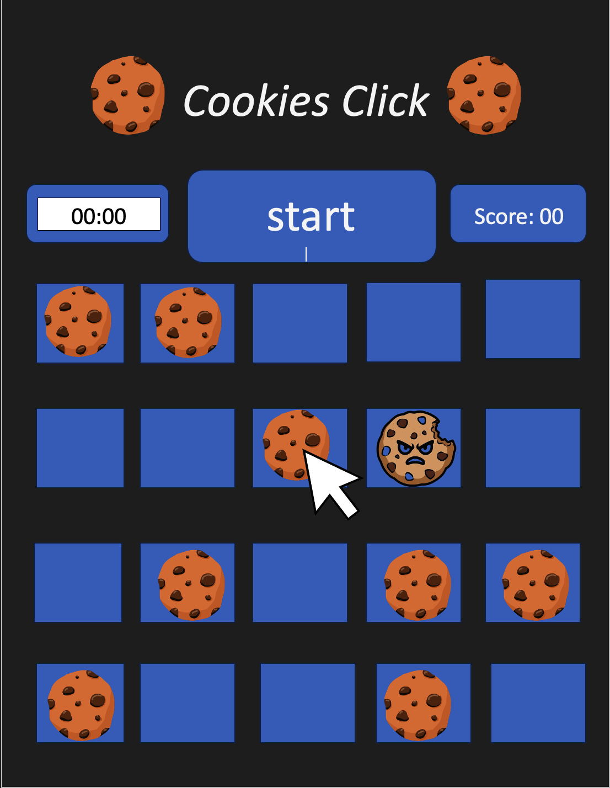
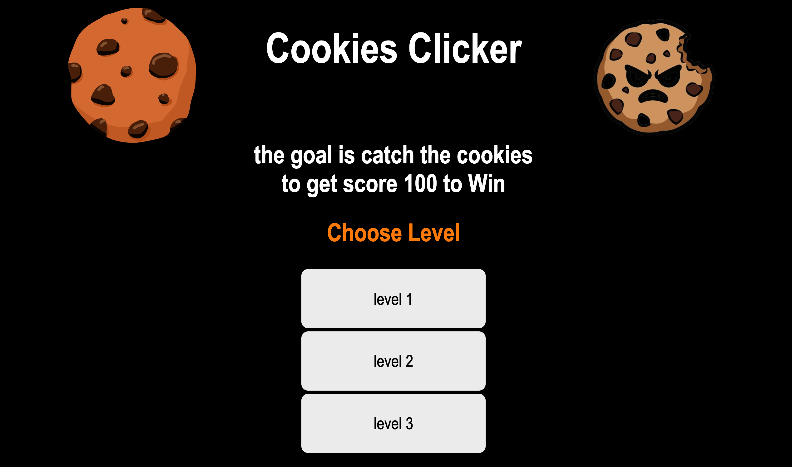
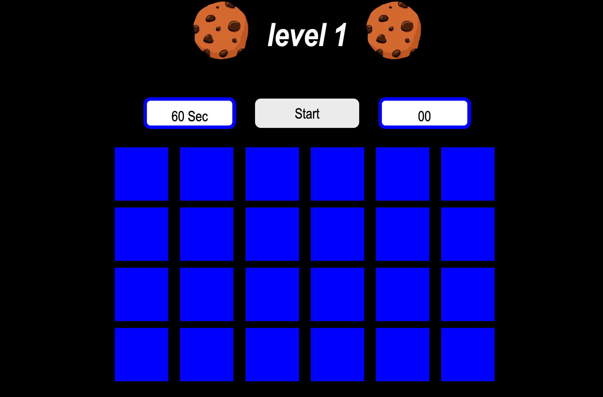
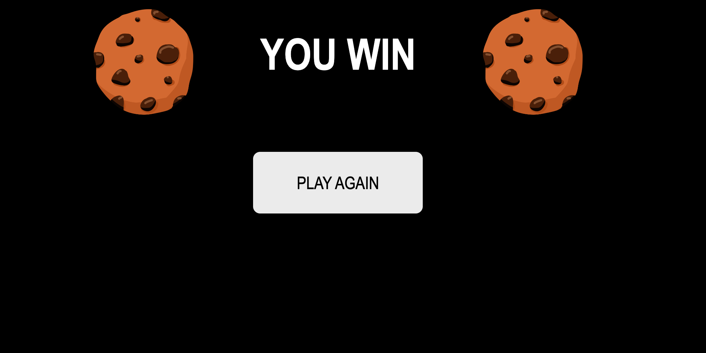
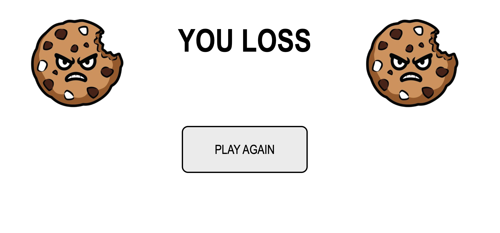

# Cookies Clicker

## By: fathy soliman

## Date: Feb 5th, 2026

### Cookies Clicker is game that can click the normal cookies not angry cookie to get heigh score for short time, if click angry cookie the game is over and loss your score

-------

#### 1- First page is a homepage has description for game to user and the user can choose the levels which level want to play

#### 2- When the user choose level the website for game will appear

#### 3- When user click the start button the game started and the cookies was appeared normal cookies and angry cookies , the timer count down. the user need to click the normal cookies to win before time is up , if user click angry cookies the timer will decrement a lot of time it depend on which level the user will choose , level 1 timer -3 sec , level 2 timer -5 sec and level 3 timer -7 sec

#### 4- when the user win, the website deliver the user to another page for winPage to Congrats to win this level, and make user press the button to play again for deliver the user to home page

#### 5- when the user loss, the website drive the user to another page for lossPage to make the user go to home page and play again

#### references:
- [MDN](https://developer.mozilla.org/en-US/)
- [w3schools](https://www.w3schools.com/)
- [animation](https://animate.style/)